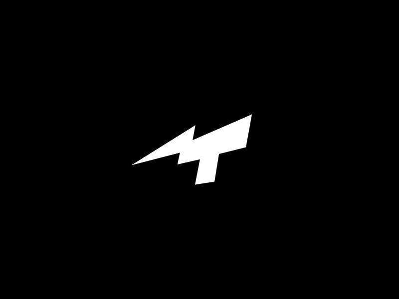

<h1> Hey! Nice to see you.</h1>

  I'm Tamal, from  <b>India, Kolkata.
<h3>Things I code with</h3>

  
  

<h3>Open source projects</h3>
<table>
  <thead align="center">
    <tr border: none;>
      <td><b>🎁 Projects</b></td>
      <td><b>⭐ Stars</b></td>
      <td><b>📚 Forks</b></td>
      <td><b>🛎 Issues</b></td>
      <td><b>📬 Pull requests</b></td>
    </tr>
  </thead>
  <tbody>
    <tr>
      <td><a href="https://github.com/thmsgbrt/react-simple-pull-to-refresh"><b>React PullToRefresh component</b></a></td>
      <td></td>
      <td></td>
      <td></td>
      <td></td>
    </tr>
	  <tr>
      <td><a href="https://github.com/thmsgbrt/Chrome-Extension-with-React-and-Typescript-Starter-Pack"><b>Typescript & React Chrome Extension Starter</b></a></td>
      <td></td>
      <td></td>
      <td></td>
      <td></td>
    </tr>
    <tr>
      <td><a href="https://github.com/thmsgbrt/nodejs-typescript-express-apollo-graphql-starter"><b>NodeJs Express TypeScript GraphQL Starter</b></a></td>
      <td></td>
      <td></td>
      <td></td>
      <td></td>
    </tr>
  </tbody>
</table>
<h3>My latest posts</h3>
<ul>
  <li><a href="https://medium.com/better-programming/create-your-first-ethereum-smart-contract-with-remix-ide-667e46e81901"><b> Create Your First Ethereum Smart Contract With Remix IDE</b></a> <i>Build a Blockchain-powered chat from your browser!.</i></li>
  <li><a href="https://medium.com/@th.guibert/how-to-create-a-self-updating-readme-md-for-your-github-profile-f8b05744ca91"><b> How to Create a Self-Updating README.md for Your GitHub Profile</b></a> <i>A good tutorial to do your first steps with GitHub Actions</i></li>
    <li><a href="https://medium.com/better-programming/how-you-should-structure-your-react-applications-e7dd32375a98"><b> How You Should Structure Your React Applications</b></a> <i>A matter of taste, sure, but here is an approach that scales.</i></li>
  <li><a href="https://medium.com/better-programming/pro-tips-to-help-you-get-started-with-your-side-project-15d01b76e0d8"><b>Pro Tips to Help You Get Started With Your Side Project</b></a> <i>Begin with solid foundations to keep the excitement kicking in...</i></li>
  <li><a href="https://medium.com/better-programming/how-to-take-care-of-your-personal-branding-as-a-programmer-2d3aeba56cb9"><b>How to Take Care of Your Personal Branding as a Programmer</b></a> <i>It’s more than just refreshing your resume</i></li>
  <li><a href="https://medium.com/better-programming/8-new-features-shipping-with-es2020-7a2721f710fb"><b>7 New Features Shipping With ES2020</b></a> <i>GlobalThis, optional chaining, private fields in classes, the nullish coalescing operator, and more</i></li>
</ul>
